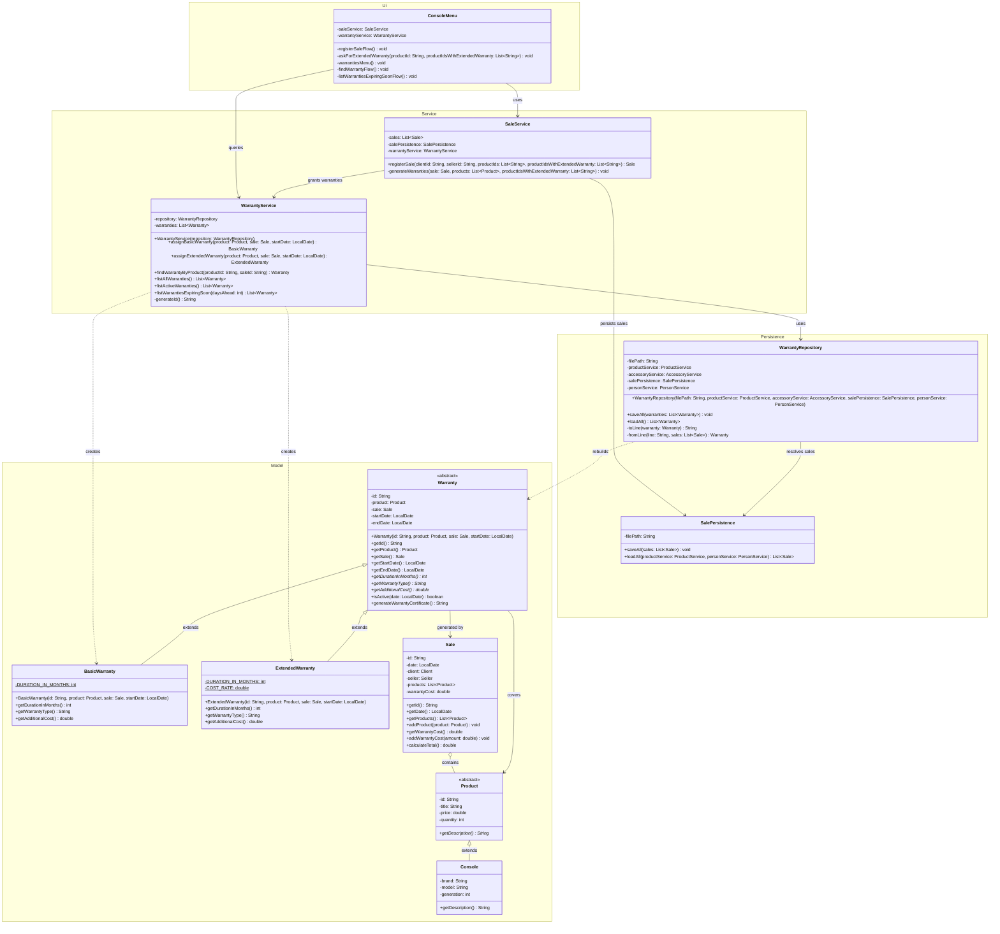

# Warranty Class Diagram

Updated class diagram of the warranty module and its integration with the classes that already existed in the system (`Sale`, `Product`, `Console`, `SaleService`, `ConsoleMenu`).

## Reading of the diagram

* **New hierarchy.** `Warranty` is abstract and concentrates the identifier, the associated product and sale, and both dates. `BasicWarranty` and `ExtendedWarranty` inherit from it and only implement the three abstract methods that change between types: duration, type name and additional cost.
* **Relationship with the existing classes.** A warranty holds an association with the `Product` it covers and with the `Sale` that generated it; neither `Product` nor `Sale` knows the warranty module, so the dependency points in a single direction and the previous modules remain untouched in that respect.
* **New persistence and service classes.** `WarrantyRepository` only reads and writes `data/warranties.csv`, using a discriminator (`BASIC` / `EXTENDED`) to rebuild the correct subtype, and receives by constructor the dependencies it needs to resolve the stored identifiers. `WarrantyService` holds every business rule of the module.
* **Integration point.** `SaleService` depends on `WarrantyService` and grants the coverage inside `registerSale`, adding the cost of the extended warranties to the sale. `ConsoleMenu` asks the seller whether the client wants extended coverage and exposes the new warranty submenu.