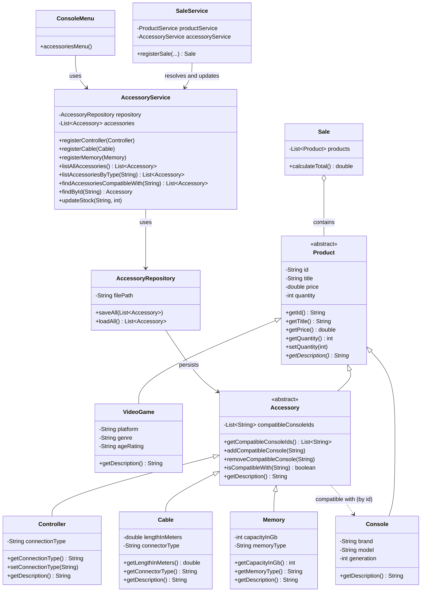

# Accessory Module — Updated Class Diagram

## Notes

- `Accessory` sits between `Product` and the three concrete accessory types, so every
  accessory is a `Product` and can be placed inside a `Sale` alongside video games and
  consoles.
- Compatibility is drawn as a dependency from `Accessory` to `Console` because the accessory
  stores console **ids**, not `Console` object references — this keeps the model layer free
  of circular references and keeps persistence flat.
