# Integrated Class Diagram - GameZone Unicesar

Single class diagram of the integrated system (Requirement 5): products, people, sales,
accessories, promotions, warranties and returns, organized in the four layers of the
workshop. Dependencies go only downward: `ui → service → persistence → model`. `Main`
builds every object and injects the dependencies by constructor.

```mermaid
classDiagram
    direction TB

    namespace ui {
        class ConsoleMenu {
            -productService: ProductService
            -personService: PersonService
            -saleService: SaleService
            -accessoryService: AccessoryService
            -returnService: ReturnService
            -promotionService: PromotionService
            -warrantyService: WarrantyService
            +start() void
        }
        class Main {
            +main(args: String[])$ void
        }
    }

    namespace service {
        class ProductService {
            +registerVideoGame(videoGame: VideoGame) void
            +registerConsole(console: Console) void
            +findById(id: String) Product
            +reduceStock(productId: String, amount: int) void
            +restoreStock(productId: String, amount: int) void
        }
        class PersonService {
            +registerClient(client: Client) void
            +findClientById(id: String) Client
            +findSellerById(id: String) Seller
        }
        class AccessoryService {
            +registerController(controller: Controller) void
            +registerCable(cable: Cable) void
            +registerMemory(memory: Memory) void
            +findAccessoriesCompatibleWith(consoleId: String) List~Accessory~
            +decreaseStock(accessoryId: String, amount: int) void
            +restoreStock(accessoryId: String, amount: int) void
        }
        class PromotionService {
            +registerPercentageDiscount(...) Promotion
            +registerCategoryDiscount(...) Promotion
            +registerBulkPurchaseDiscount(...) Promotion
            +listActivePromotions() List~Promotion~
            +findBestPromotionFor(sale: Sale) Promotion
        }
        class WarrantyService {
            -warranties: List~Warranty~
            +assignBasicWarranty(product: Product, sale: Sale, startDate: LocalDate) BasicWarranty
            +assignExtendedWarranty(product: Product, sale: Sale, startDate: LocalDate) ExtendedWarranty
            +findWarrantyByProduct(productId: String, saleId: String) Warranty
            +listActiveWarranties() List~Warranty~
            +listWarrantiesExpiringSoon(daysAhead: int) List~Warranty~
            +cancelWarranties(productId: String, saleId: String) double
            -loadWarranties() List~Warranty~
        }
        class SaleService {
            -sales: List~Sale~
            +registerSale(clientId: String, sellerId: String, productIds: List~String~, productIdsWithExtendedWarranty: List~String~) Sale
            -resolveItems(productIds: List~String~) List~Product~
            -createSale(client: Client, seller: Seller, items: List~Product~) Sale
            -applyBestPromotion(sale: Sale) void
            -generateWarranties(sale: Sale, items: List~Product~, ids: List~String~) void
            -updateInventory(items: List~Product~) void
            +findById(saleId: String) Sale
        }
        class ReturnService {
            -returns: List~Return~
            +registerReturn(saleId: String, productIds: List~String~, reason: String) Return
            +calculateMonthlySales(month: int, year: int) double
            +calculateMonthlyReturns(month: int, year: int) double
            +generateMonthlyBalance(month: int, year: int) double
        }
    }

    namespace persistence {
        class ProductRepository {
            +save(products: List~Product~) void
            +load() List~Product~
        }
        class PersonRepository
        class AccessoryRepository {
            +saveAll(accessories: List~Accessory~) void
            +loadAll() List~Accessory~
        }
        class PromotionRepository {
            +saveAll(promotions: List~Promotion~) void
            +loadAll() List~Promotion~
        }
        class SalePersistence {
            -accessoryService: AccessoryService
            +saveAll(sales: List~Sale~) void
            +loadAll(productService: ProductService, personService: PersonService) List~Sale~
        }
        class WarrantyRepository {
            -filePath: String
            +saveAll(warranties: List~Warranty~) void
            +loadAll() List~WarrantyRecord~
        }
        class WarrantyRecord {
            <<record>>
            +type: String
            +id: String
            +productId: String
            +saleId: String
            +startDate: LocalDate
        }
        class ReturnRepository {
            +saveAll(returns: List~Return~) void
            +loadAll() List~Return~
        }
    }

    namespace model {
        class Product {
            <<abstract>>
            -id: String
            -title: String
            -price: double
            -quantity: int
            +getDescription()* String
        }
        class VideoGame {
            -platform: String
            -genre: String
            -ageRating: String
        }
        class Console {
            -brand: String
            -model: String
            -generation: int
        }
        class Accessory {
            <<abstract>>
            -compatibleConsoleIds: List~String~
            +isCompatibleWith(consoleId: String) boolean
        }
        class Controller {
            -connectionType: String
        }
        class Cable {
            -lengthInMeters: double
            -connectorType: String
        }
        class Memory {
            -capacityInGb: int
            -memoryType: String
        }
        class Person {
            <<abstract>>
            -id: String
            -name: String
            -phone: String
        }
        class Client {
            -email: String
        }
        class Seller {
            -employeeCode: String
            -workShift: String
        }
        class Sale {
            -id: String
            -date: LocalDate
            -products: List~Product~
            -appliedPromotionName: String
            -discountAmount: double
            -warrantyCost: double
            +calculateTotal() double
            +calculateFinalTotal() double
            +addWarrantyCost(amount: double) void
            +canBeReturned() boolean
            +generateReceipt() String
        }
        class Promotion {
            <<abstract>>
            -id: String
            -name: String
            -startDate: LocalDate
            -endDate: LocalDate
            +isActive(date: LocalDate) boolean
            +calculateDiscount(sale: Sale)* double
        }
        class PercentageDiscount {
            -percentage: double
        }
        class CategoryDiscount {
            -percentage: double
            -targetCategory: String
        }
        class BulkPurchaseDiscount {
            -minQuantity: int
            -percentage: double
        }
        class Warranty {
            <<abstract>>
            -id: String
            -product: Product
            -sale: Sale
            -startDate: LocalDate
            -endDate: LocalDate
            +getDurationInMonths()* int
            +getWarrantyType()* String
            +getAdditionalCost()* double
            +isActive(date: LocalDate) boolean
            +generateWarrantyCertificate() String
        }
        class BasicWarranty
        class ExtendedWarranty
        class Return {
            -id: String
            -date: LocalDate
            -originalSale: Sale
            -returnedProducts: List~Product~
            -refundAmount: double
            -warrantyRefund: double
            +calculatePaidRatio() double
            +calculateItemRefund(product: Product) double
            +calculateRefundAmount() double
            +generateReturnReceipt() String
        }
    }

    %% Inheritance
    Product <|-- VideoGame
    Product <|-- Console
    Product <|-- Accessory
    Accessory <|-- Controller
    Accessory <|-- Cable
    Accessory <|-- Memory
    Person <|-- Client
    Person <|-- Seller
    Promotion <|-- PercentageDiscount
    Promotion <|-- CategoryDiscount
    Promotion <|-- BulkPurchaseDiscount
    Warranty <|-- BasicWarranty
    Warranty <|-- ExtendedWarranty

    %% Model associations
    Sale --> Client : client
    Sale --> Seller : seller
    Sale "1" --> "1..*" Product : items
    Warranty --> Product : covers
    Warranty --> Sale : belongs to
    Return --> Sale : original sale
    Return "1" --> "1..*" Product : returned items
    Promotion ..> Sale : calculates discount

    %% UI layer
    Main ..> ConsoleMenu : creates
    ConsoleMenu --> ProductService
    ConsoleMenu --> PersonService
    ConsoleMenu --> SaleService
    ConsoleMenu --> AccessoryService
    ConsoleMenu --> PromotionService
    ConsoleMenu --> WarrantyService
    ConsoleMenu --> ReturnService

    %% Service layer
    SaleService --> ProductService
    SaleService --> PersonService
    SaleService --> AccessoryService
    SaleService --> PromotionService
    SaleService --> WarrantyService
    SaleService --> SalePersistence
    ReturnService --> SaleService
    ReturnService --> ProductService
    ReturnService --> AccessoryService
    ReturnService --> WarrantyService
    ReturnService --> ReturnRepository
    WarrantyService --> WarrantyRepository
    WarrantyService --> SalePersistence
    WarrantyService --> ProductService
    ProductService --> ProductRepository
    PersonService --> PersonRepository
    AccessoryService --> AccessoryRepository
    PromotionService --> PromotionRepository

    %% Persistence layer
    WarrantyRepository ..> WarrantyRecord : loads
    SalePersistence ..> Sale : persists
    ReturnRepository ..> Return : persists
    ProductRepository ..> Product : persists
    AccessoryRepository ..> Accessory : persists
    PromotionRepository ..> Promotion : persists
```

## Notes

- **Sale flow (A3):** validate items → resolve products/accessories and stock → create sale →
  best promotion over the items → warranties for consoles → final total → inventory →
  persistence.
- **Warranties (A2):** `WarrantyRepository` stores only ids (`WarrantyRecord`) and depends on
  no service; `WarrantyService` resolves `Sale` and `Product`. The dependency goes in a single
  direction: `SaleService → WarrantyService → WarrantyRepository`.
- **Returns (A4, A5, A7):** stock is restored through `ProductService` or `AccessoryService`;
  each item is refunded proportionally to the sale discount; the warranties of a returned
  console are cancelled and the extended warranty cost is refunded.
- **Balance (A6):** monthly sales use the final total of each sale; monthly returns use the
  refund of each return.
- `SalePersistence` and `ReturnRepository` receive services to resolve references while
  loading (as designed in the Taller and the returns requirement); A2 removed this
  dependency only from the warranty module, which is where it produced a cycle.