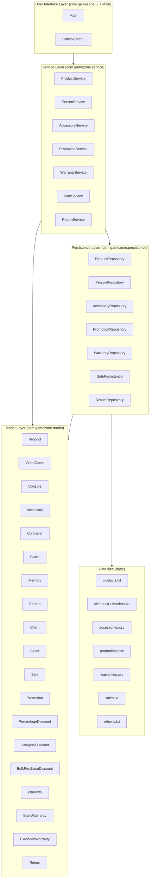
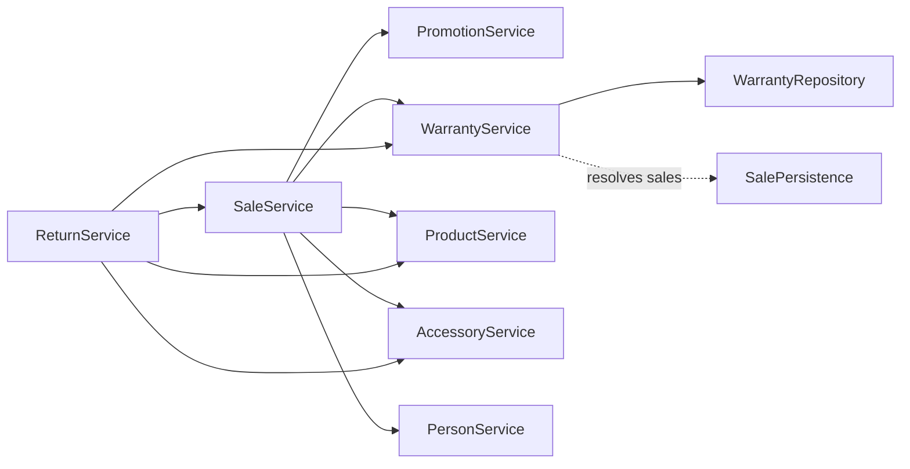

# Layers Diagram

Four-layer architecture of the integrated system (Requirement 5). Each layer only depends
on the layers below it: `ui → service → persistence → model`. `Main` is the entry point:
it creates every repository and service, injects the dependencies by constructor and
starts `ConsoleMenu`.

## Responsibilities per layer

| Layer | Responsibility | Classes |
|---|---|---|
| UI | Console menu (messages in Spanish) and application startup. It only calls services. | `Main`, `ConsoleMenu` |
| Service | Business rules: stock, best promotion, warranties for consoles, unified sale flow, returns, refunds and monthly balance. | `ProductService`, `PersonService`, `AccessoryService`, `PromotionService`, `WarrantyService`, `SaleService`, `ReturnService` |
| Persistence | Reading and writing the files in `data/`. No business rules. | `ProductRepository`, `PersonRepository`, `AccessoryRepository`, `PromotionRepository`, `WarrantyRepository`, `SalePersistence`, `ReturnRepository` |
| Model | Domain classes and their intrinsic behavior (totals, discounts, warranty duration, refund). No file access. | Products, accessories, people, sale, promotions, warranties and returns |

## Main service dependencies

There is no cycle between services: `WarrantyService` does not depend on `SaleService`
(integration adjustment A2), so `Main` can build `WarrantyService` first, then
`SaleService` and finally `ReturnService`.
