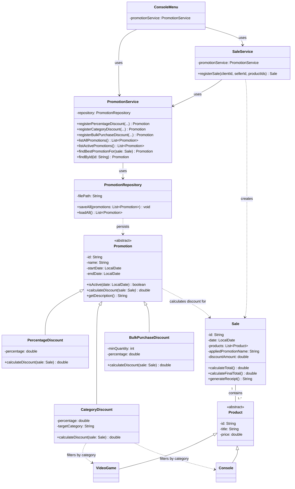

# Promotion Module - Class Diagram

```mermaid
classDiagram
    class Promotion {
        <<abstract>>
        -id: String
        -name: String
        -startDate: LocalDate
        -endDate: LocalDate
        +isActive(date: LocalDate) boolean
        +calculateDiscount(sale: Sale)* double
        +getDescription() String
    }

    class PercentageDiscount {
        -percentage: double
        +calculateDiscount(sale: Sale) double
    }

    class CategoryDiscount {
        -percentage: double
        -targetCategory: String
        +calculateDiscount(sale: Sale) double
    }

    class BulkPurchaseDiscount {
        -minQuantity: int
        -percentage: double
        +calculateDiscount(sale: Sale) double
    }

    class Sale {
        -id: String
        -date: LocalDate
        -products: List~Product~
        -appliedPromotionName: String
        -discountAmount: double
        +calculateTotal() double
        +calculateFinalTotal() double
        +generateReceipt() String
    }

    class Product {
        <<abstract>>
        -id: String
        -title: String
        -price: double
    }

    class VideoGame
    class Console

    class PromotionRepository {
        -filePath: String
        +saveAll(promotions: List~Promotion~) void
        +loadAll() List~Promotion~
    }

    class PromotionService {
        -repository: PromotionRepository
        +registerPercentageDiscount(...) Promotion
        +registerCategoryDiscount(...) Promotion
        +registerBulkPurchaseDiscount(...) Promotion
        +listAllPromotions() List~Promotion~
        +listActivePromotions() List~Promotion~
        +findBestPromotionFor(sale: Sale) Promotion
        +findById(id: String) Promotion
    }

    class SaleService {
        -promotionService: PromotionService
        +registerSale(clientId, sellerId, productIds) Sale
    }

    class ConsoleMenu {
        -promotionService: PromotionService
    }

    Promotion <|-- PercentageDiscount
    Promotion <|-- CategoryDiscount
    Promotion <|-- BulkPurchaseDiscount
    Promotion ..> Sale : calculates discount for
    Sale "1" -- "1..*" Product : contains
    Product <|-- VideoGame
    Product <|-- Console
    CategoryDiscount ..> VideoGame : filters by category
    CategoryDiscount ..> Console : filters by category
    PromotionRepository ..> Promotion : persists
    PromotionService --> PromotionRepository : uses
    SaleService --> PromotionService : uses
    SaleService ..> Sale : creates
    ConsoleMenu --> PromotionService : uses
    ConsoleMenu --> SaleService : uses
```