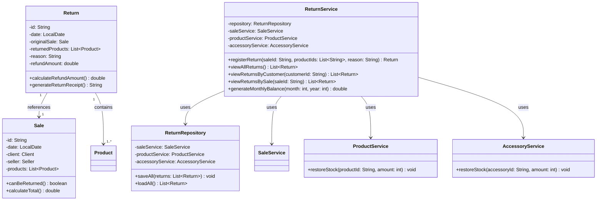

# Return Module - Class Diagram

```mermaid
classDiagram
    class Sale {
        -id: String
        -date: LocalDate
        -client: Client
        -seller: Seller
        -products: List~Product~
        +canBeReturned() boolean
        +calculateTotal() double
    }

    class Return {
        -id: String
        -date: LocalDate
        -originalSale: Sale
        -returnedProducts: List~Product~
        -reason: String
        -refundAmount: double
        +calculateRefundAmount() double
        +generateReturnReceipt() String
    }

    class ReturnRepository {
        -saleService: SaleService
        -productService: ProductService
        -accessoryService: AccessoryService
        +saveAll(returns: List~Return~) void
        +loadAll() List~Return~
    }

    class ReturnService {
        -repository: ReturnRepository
        -saleService: SaleService
        -productService: ProductService
        -accessoryService: AccessoryService
        +registerReturn(saleId: String, productIds: List~String~, reason: String) Return
        +viewAllReturns() List~Return~
        +viewReturnsByCustomer(customerId: String) List~Return~
        +viewReturnsBySale(saleId: String) List~Return~
        +generateMonthlyBalance(month: int, year: int) double
    }

    class ProductService {
        +restoreStock(productId: String, amount: int) void
    }

    class AccessoryService {
        +restoreStock(accessoryId: String, amount: int) void
    }

    Return "1" --> "1" Sale : references
    Return "1" --> "1..*" Product : contains
    ReturnService --> ReturnRepository : uses
    ReturnService --> SaleService : uses
    ReturnService --> ProductService : uses
    ReturnService --> AccessoryService : uses
```
