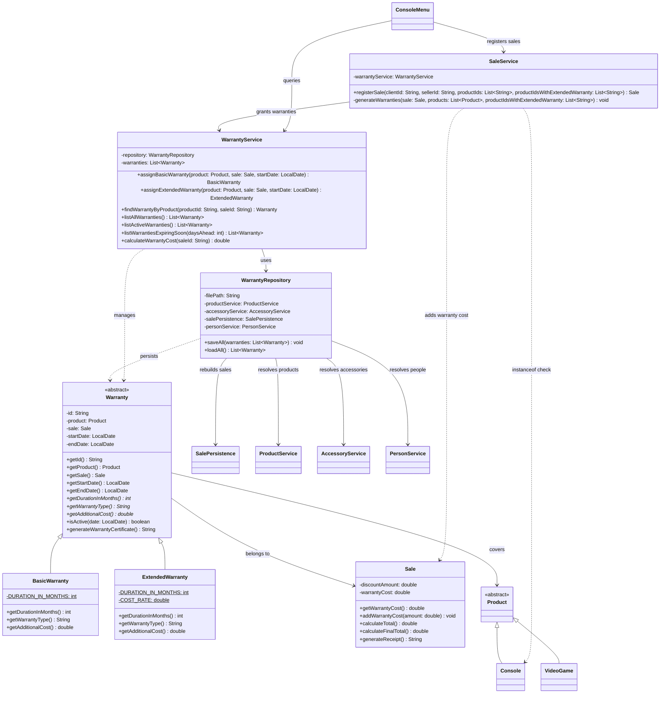

# Warranty Module - Class Diagram

```mermaid
classDiagram
    class Warranty {
        <<abstract>>
        -id: String
        -product: Product
        -sale: Sale
        -startDate: LocalDate
        -endDate: LocalDate
        +getId() String
        +getProduct() Product
        +getSale() Sale
        +getStartDate() LocalDate
        +getEndDate() LocalDate
        +getDurationInMonths()* int
        +getWarrantyType()* String
        +getAdditionalCost()* double
        +isActive(date: LocalDate) boolean
        +generateWarrantyCertificate() String
    }

    class BasicWarranty {
        -DURATION_IN_MONTHS: int$
        +getDurationInMonths() int
        +getWarrantyType() String
        +getAdditionalCost() double
    }

    class ExtendedWarranty {
        -DURATION_IN_MONTHS: int$
        -COST_RATE: double$
        +getDurationInMonths() int
        +getWarrantyType() String
        +getAdditionalCost() double
    }

    class Sale {
        -discountAmount: double
        -warrantyCost: double
        +getWarrantyCost() double
        +addWarrantyCost(amount: double) void
        +calculateTotal() double
        +calculateFinalTotal() double
        +generateReceipt() String
    }

    class Product {
        <<abstract>>
    }
    class Console
    class VideoGame

    class WarrantyRepository {
        -filePath: String
        -productService: ProductService
        -accessoryService: AccessoryService
        -salePersistence: SalePersistence
        -personService: PersonService
        +saveAll(warranties: List~Warranty~) void
        +loadAll() List~Warranty~
    }

    class WarrantyService {
        -repository: WarrantyRepository
        -warranties: List~Warranty~
        +assignBasicWarranty(product: Product, sale: Sale, startDate: LocalDate) BasicWarranty
        +assignExtendedWarranty(product: Product, sale: Sale, startDate: LocalDate) ExtendedWarranty
        +findWarrantyByProduct(productId: String, saleId: String) Warranty
        +listAllWarranties() List~Warranty~
        +listActiveWarranties() List~Warranty~
        +listWarrantiesExpiringSoon(daysAhead: int) List~Warranty~
        +calculateWarrantyCost(saleId: String) double
    }

    class SaleService {
        -warrantyService: WarrantyService
        +registerSale(clientId: String, sellerId: String, productIds: List~String~, productIdsWithExtendedWarranty: List~String~) Sale
        -generateWarranties(sale: Sale, products: List~Product~, productIdsWithExtendedWarranty: List~String~) void
    }

    class SalePersistence
    class ProductService
    class AccessoryService
    class PersonService
    class ConsoleMenu

    Warranty <|-- BasicWarranty
    Warranty <|-- ExtendedWarranty
    Product <|-- Console
    Product <|-- VideoGame
    Warranty --> Product : covers
    Warranty --> Sale : belongs to

    WarrantyRepository ..> Warranty : persists
    WarrantyRepository --> ProductService : resolves products
    WarrantyRepository --> AccessoryService : resolves accessories
    WarrantyRepository --> SalePersistence : rebuilds sales
    WarrantyRepository --> PersonService : resolves people
    WarrantyService --> WarrantyRepository : uses
    WarrantyService ..> Warranty : manages

    SaleService --> WarrantyService : grants warranties
    SaleService ..> Console : instanceof check
    SaleService ..> Sale : adds warranty cost
    ConsoleMenu --> WarrantyService : queries
    ConsoleMenu --> SaleService : registers sales
```

